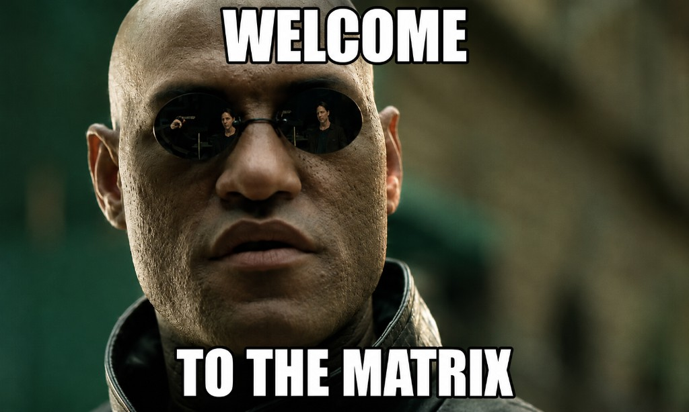
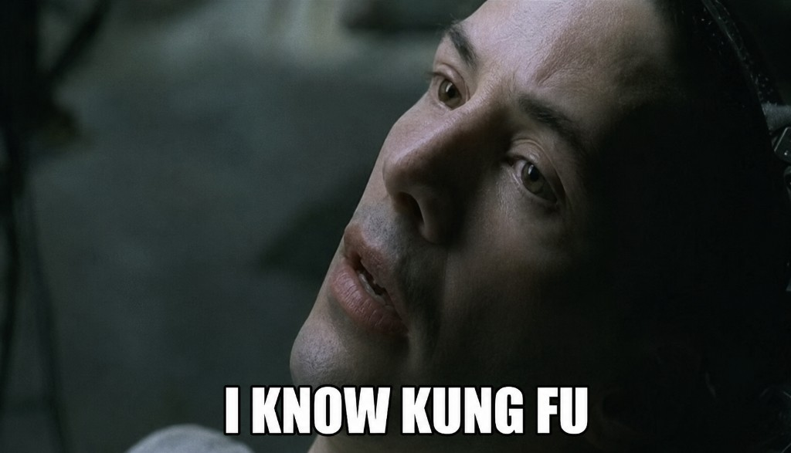

Hey, :partly_sunny:

Thanks for stopping by. Feel free to explore my repos and view my resume -
https://drive.google.com/file/d/1ap-umGz1cxqbseno9buNBw1WCePFgUUE/view?usp=sharing

  

  
  
  

**Key Programming Languages -**

**Also worked with -**

**Skills & Tools :rocket:** -

  

- **Full-Stack Web Development**

- **Machine Learning / AI**

- **Other**

**Projects** -

  

<ul>
  <li><a href="https://github.com/amifunny/GovSimAI" target="_blank" rel="noopener noreferrer">GovSimAI</a> - Multi-agent public-policy evaluator with judge agents and MCP adapters</li>
  <li><a href="https://github.com/amifunny/InterviewerOS" target="_blank" rel="noopener noreferrer">InterviewerOS</a> - AI mock interview platform with voice flow and performance reports</li>
  <li><a href="https://github.com/amifunny/PetSpot" target="_blank" rel="noopener noreferrer">PetSpot</a> - Pet Owners' social networking application</li>
  <li><a href="https://github.com/amifunny/trend-store" target="_blank" rel="noopener noreferrer">Trend Store</a> - E-commerce app using Django</li>
  <li><a href="https://github.com/amifunny/pro-manage" target="_blank" rel="noopener noreferrer">Pro-Manage</a> - Kanban board app to manage projects</li>
  <li><a href="https://github.com/amifunny/HorcruxZ" target="_blank" rel="noopener noreferrer">HorcruxZ</a> - FPS shooter with Horcruxes and zombie survival gameplay</li>
  <li><a href="https://github.com/amifunny/Save-Your-Head" target="_blank" rel="noopener noreferrer">Save-Your-Head</a> - Arcade-style game project built with Unity</li>
  <li><a href="https://github.com/amifunny/tf-stitch" target="_blank" rel="noopener noreferrer">tf-stitch</a> - Pip package to quick-start deep learning projects</li>
  <li><a href="https://github.com/amifunny/Piano-Synth" target="_blank" rel="noopener noreferrer">Piano-Synth</a> - Virtual piano with deep learning assist</li>
  <li><a href="https://github.com/amifunny/likely" target="_blank" rel="noopener noreferrer">Recommendation System</a> - SVD, KNN and bandits for movie recommendations</li>
  <li><a href="https://github.com/amifunny/Reinforce_Adventure" target="_blank" rel="noopener noreferrer">Reinforcement Learning</a> - Popular RL algorithms implemented in Gym</li>
</ul>

<ul>
  <li>Chrome Extensions
    <ul>
      <li><a href="https://github.com/amifunny/Dark_Mode_Chrome" target="_blank" rel="noopener noreferrer">Dark-Mode-Chrome</a>: Makes reading easy in dark on any website</li>
      <li><a href="https://github.com/amifunny/Scrape-Pad-Browser-Extension" target="_blank" rel="noopener noreferrer">Scrape-Pad</a>: Quickly take notes and export docs</li>
      <li><a href="https://github.com/amifunny/CommentX" target="_blank" rel="noopener noreferrer">CommentX</a>: Read and write comments on any web URL</li>
    </ul>
  </li>
</ul>

My DDPG tutorial on Keras website - <a href="https://keras.io/examples/rl/ddpg_pendulum/" target="_blank" rel="noopener noreferrer">https://keras.io/examples/rl/ddpg_pendulum/</a>
